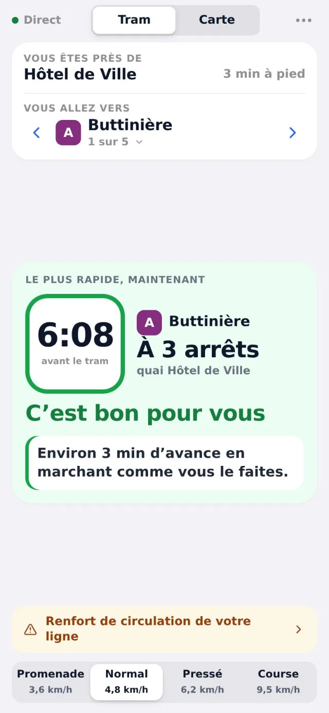

<p align="center"><a href="https://engob.github.io/TBMTramRadar/"></a></p>

<p align="center">
  <a href="https://engob.github.io/TBMTramRadar/"></a>
  
  <a href="https://engob.github.io/portofolio/projets/tbm-tram-radar/"></a>
</p>

<h1 align="center">Tram Radar</h1>
<p align="center"><b>« Est-ce que je l'ai ? » La réponse, en temps réel.</b><br>À Bordeaux, l'app vous dit si vous aurez votre tram, selon l'endroit où vous êtes et la vitesse à laquelle vous marchez.</p>

---

### Le problème

Les applis de transport donnent l'heure de passage, pas la vraie question : ai-je le temps d'y arriver à pied ?

### L'idée

Un seul écran, une seule réponse : croiser le temps réel officiel du réseau avec un vrai itinéraire piéton et votre allure.

### Comment c'est fait

Application web installable, sans framework. Données ouvertes du réseau TBM (temps réel, horaires, tracés) et itinéraires piétons OpenStreetMap ; les lignes sont régénérées chaque nuit par GitHub Actions.

**Outils** &nbsp; `PWA` `Open data TBM` `OpenStreetMap` `GitHub Actions`

### Aperçu

<p align="center"> </p>

### Mentions

Application indépendante, **non affiliée** à TBM, Keolis Bordeaux Métropole ou Bordeaux Métropole. Données temps réel : open data de Bordeaux Métropole (Licence Ouverte Etalab). Fonds de carte © contributeurs OpenStreetMap.

### English

**Tram Radar** — *“Will I make it?” Answered in real time.* In Bordeaux, the app tells you whether you'll catch your tram, based on where you are and how fast you walk.

Transit apps show departure times, not the real question: do I have time to get there on foot? One screen, one answer: combine the network's official real-time data with an actual walking route and your pace. An installable web app with no framework. Open data from the TBM network (real time, timetables, routes) and OpenStreetMap walking directions; lines are rebuilt every night by GitHub Actions.

---

<p align="center"><sub>Conçu, développé et mis en ligne par <b>Sébastien Khai</b>, Product Builder · <a href="https://engob.github.io/portofolio/">portfolio</a> · <a href="https://engob.github.io/portofolio/projets/tbm-tram-radar/">fiche du projet</a><br>© 2026 Sébastien Khai — tous droits réservés.</sub></p>


<details>
<summary><b>Documentation technique</b> · notes de développement et de mise en ligne</summary>

## TBM Tram Radar Bordeaux

Web app mobile, un seul écran : la station la plus proche, le sens choisi (terminus), et en temps réel
« est-ce que je l'ai ? » selon votre allure. Temps réel officiel TBM, itinéraire piéton réel.

### App iOS (App Store)

Voir **APPSTORE.md** : règle 4.2, confidentialité, construction avec Capacitor et Xcode.

### Mise en ligne sur GitHub Pages (5 minutes)

1. Créez un dépôt GitHub (public, ou privé avec un compte qui autorise Pages).
2. Envoyez le contenu de ce dossier sur la branche `main` :
   ```bash
   git init && git add . && git commit -m "Tram Radar 5.0.0"
   git branch -M main
   git remote add origin https://github.com/VOTRE-COMPTE/tbm-tram-radar.git
   git push -u origin main
   ```
3. Sur GitHub : **Settings > Pages > Build and deployment > Source : GitHub Actions**.
4. L'onglet **Actions** montre le déploiement ; l'app est ensuite sur
   `https://VOTRE-COMPTE.github.io/tbm-tram-radar/`.
5. Sur le téléphone, ouvrez l'adresse puis « Ajouter à l'écran d'accueil ».

### Mises à jour automatiques et versions

- À chaque `git push` sur `main`, GitHub Actions republie le site.
- Le script `tools/stamp_version.py` calcule un **build** (empreinte du contenu) et l'inscrit
  dans `version.json`, `sw.js` et `index.html`.
- L'app vérifie `version.json` à l'ouverture, au retour au premier plan et toutes les 10 minutes.
  Si le build a changé, le service worker télécharge la nouvelle version :
  - dans les 15 premières secondes ou quand l'app passe en arrière-plan, elle s'applique seule ;
  - sinon un bandeau « Mettre à jour » s'affiche (pas de rechargement surprise en pleine marche).
- Pour une nouvelle version fonctionnelle : modifiez `version.json` (`"version": "3.1.0"`),
  notez-la dans `CHANGELOG.md`, puis poussez. Le numéro s'affiche en bas du panneau.
- Chaque nuit, le workflow régénère `data/network.json` depuis le GTFS TBM (couleurs officielles,
  tracés réels des lignes A à F). Un nouveau build n'est produit que si les données ont changé.

### Si le temps réel ne s'affiche pas (CORS)

Si la pastille en haut indique « Erreur » avec un message CORS, le navigateur bloque l'appel direct
à l'API TBM. Déployez le relais `worker/cors-proxy.js` sur Cloudflare Workers (gratuit), puis
collez son adresse dans **Réglages** (`https://…workers.dev/?url={url}`), ou mettez-la dans
`assets/config.js` (`proxy`) pour tous les utilisateurs.

### Sources de données

- Temps réel : SIRI Lite TBM (estimated-timetable, stoppoints-discovery, general-message),
  Bordeaux Métropole, Licence Ouverte.
- Tracés et couleurs : GTFS TBM (même jeu de données).
- Itinéraires piétons : OSRM (serveur FOSSGIS routing.openstreetmap.de), données OpenStreetMap.
  Serveur modifiable dans `assets/config.js`.
- Fond de carte : CARTO Voyager, OpenStreetMap.

### Structure

```
index.html              page unique
assets/app.js           application
assets/app.css          styles
assets/config.js        réglages (lignes, API, relais, fréquences)
sw.js                   service worker (hors ligne + mises à jour)
version.json            version affichée et build
data/network.json       couleurs et tracés (régénéré au déploiement)
tools/                  scripts de build (GTFS, versionnage)
worker/cors-proxy.js    relais CORS facultatif
.github/workflows/      publication automatique
```

Test en local : `python3 -m http.server 8080` puis http://localhost:8080

</details>
